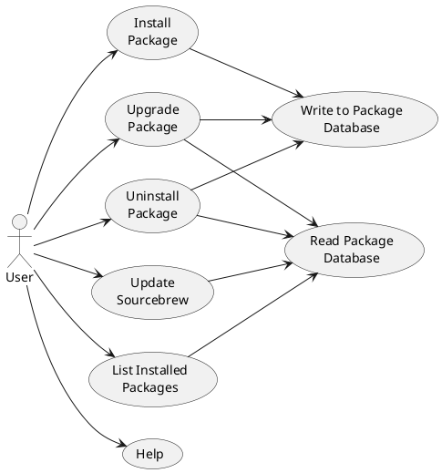

# Sourcebrew Architecture

- need to keep a database of latest build times for all packages installed, whether a package has been installed or not, what files have been generated by a recipe and are user accessible
- consider removing `recipe_install_command` over security concerns
- Need to keep a JSON database for packages, Homebrew does this with [INSTALL_RECEIPT.json](https://github.com/Homebrew/brew/pull/17554) in each package directory. Possible approaches:
  - `INSTALL_RECEIPT.json` in each package directory. Persists configuration on changes to the package list (name changes, package removal, etc.) but requires special configuration to maintain during clean operations since the whole package directory gets deleted. If cleaned with Sourcebrew operations `INSTALL_RECEIPT.json` can be copied and added to a recreated, now empty, package directory, but if a user deletes the directory manually config information gets lost.
  - `INSTALL_RECEIPT.json` in each recipe directory. Persists configuration on clean operations without issue, but is not at all resistant to package list changes. No simple way to fix this issue.
  - Series of `.json` files in a special database directory, separate from package or recipe directories. Increases complexity, but avoids cleaning or package change issues.
